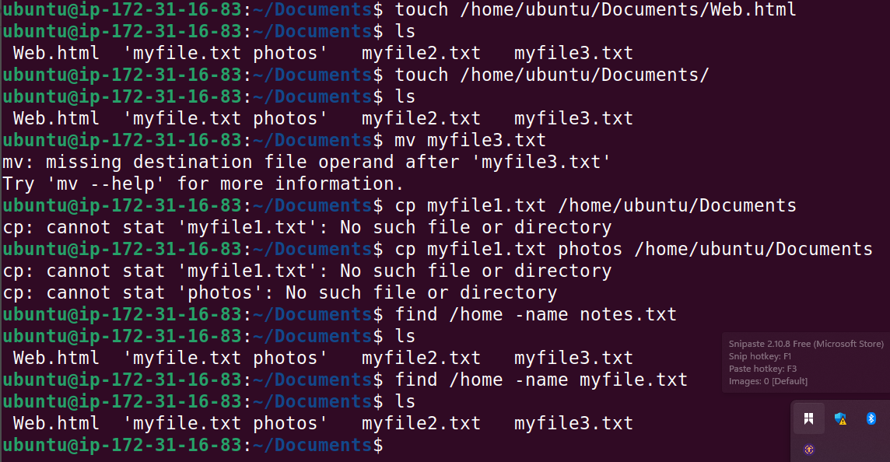

# Linux-Commands-D-D
The implementation of an in-depth exploration of essential and advanced Linux Commands, focusing on how they work, their options, and practical use cases

## Sudo Command

The sudo command, short for "superuserdo," is used to grant a user administrative privileges, allowing them to access and manage root files and directories

We use the following syntax for sudo `sudo root`

## MKDIR Command

It is used to create a new directory or folders, and the parameter will be the name of directory in which I will pass to it for instance 'mkdir photos' will create a photos directory etc.

## LS and CD Command

We use ls command to explore different root directories and get some experience navigating them while cd command is used to navigate through the linux files and directories.

## CAT Command

cat command is one of the most frequently used Linux commands. It lists, combines and writes file content to the standard output (i. e to the terminal console).

## CP, RM, MV COMMAND FILE.TXT

